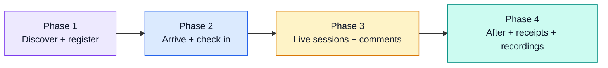

# Orkora delegate end-to-end flow

The journey of an attendee (delegate) from discovering an event to receiving the recording afterwards. Each phase is annotated with what the delegate does, what the platform shows them, and what runs server-side.

This is a product spec doc, not engineering scope. For API contracts see `apps/api/src/modules/*/`, for the public web flow see `apps/web/app/(public)/e/[code]/`, for the live engagement gateway see `apps/api/src/modules/engagement/`.

---

## Phases at a glance

---

## Phase 1 — Discover and register (pre-event)

### 1.1  Public event page
- **URL**: `orkora.events/e/<code>` — public, no auth required.
- **Renders**: banner, title, dates, location, agenda (tracks + sessions + speakers), ticket tiers with availability + pricing in the delegate's currency.
- **Page source**: `apps/web/app/(public)/e/[code]/page.tsx`.
- **API**: `GET /v1/public/events/:code` (no auth).

### 1.2  Pick a tier
- General admission, VIP, group, or free. Sale windows enforced (tier hidden if outside window). Inventory enforced (tier disabled if sold out).
- Group buy collects per-attendee detail upfront.

### 1.3  Enter details + pay
- Delegate enters name, email, optional phone, holder details for group buys.
- On Pay, the API picks the provider matching the buyer's currency from the org's per-currency preference (`USD → Stripe`, `NGN/GHS/KES → Paystack`, `NGN/GHS/KES → Flutterwave` as configured).
- Hosted checkout redirect (Stripe / Paystack / Flutterwave). Browser comes back to `/r/<orderId>/confirm` on success or `/r/<orderId>/cancelled` on cancel.
- Free tier: skip checkout, instant confirmation.
- **Idempotency**: every payment surface (checkout-creation, webhook handler, return-from-provider verifier) uses a deduplication key so a flaky network never produces a double charge.

### 1.4  Confirmation email
- Delegate receives a Postmark email from the org's branded sender, with:
  - Order ID, paid total in the buyer's currency
  - Per-ticket tap-to-open link `orkora.events/t/<code>`
  - PDF receipt attached
- Email template: `apps/api/src/modules/notifications/templates.ts`.

---

## Phase 2 — Arrive and check in (day-of)

### 2.1  Open the ticket link
- Delegate taps the email link on their phone. Opens to `/t/<code>`, which shows the QR + ticket details.
- The QR encodes a signed HMAC token tied to (ticket id, event id, server pepper). Cannot be forged.

### 2.2  Install the PWA (optional but recommended)
- The web app prompts to install. On iOS Safari: Share → Add to Home Screen. Android Chrome: address-bar install icon.
- The installed PWA's service worker (`orkora-v3-2026-06-28`) caches the ticket page + QR token for 7 days. **Venue wifi failure no longer breaks check-in.**

### 2.3  Scanner reads the QR
- At the door, an org member with the "scanner" role opens the dashboard on their phone (any modern browser), hits Check-in.
- The phone camera reads the QR. The dashboard POSTs the signed token to `/v1/checkins/scan`. The API:
  - Verifies the HMAC signature
  - Checks the ticket is paid + not refunded + not already used
  - Records the check-in with timestamp + scanner user id + venue id (if multi-door)
  - Returns OK / "already used" / "refunded - voided" / "wrong event"
- Audible + visual feedback on the scanner phone.

### 2.4  Live counter updates
- The check-in mutation triggers a WebSocket broadcast to the organizer dashboard, updating the "Checked in" counter and the rolling 60-minute attendance chart.

---

## Phase 3 — Sessions and comments (live)

### 3.1  Browse the agenda
- The same public event page becomes the live home: each session card now shows its real-time state (upcoming, in window, ended).
- Session cards with active live-stream URLs surface a "Join live" CTA the moment the session enters its window.

### 3.2  Join a session
- Tap the CTA. Opens the session live view: embedded stream URL on the left, chat panel on the right (or stacked on mobile).
- Client opens a WebSocket connection to `wss://<api>/engagement` and subscribes to `session:<sessionId>`.

### 3.3  Post a comment
- Delegate types in the chat input, hits send.
- Client emits a `chat:message` event over the WebSocket.
- Gateway (`apps/api/src/modules/engagement/engagement.gateway.ts`) does:
  1. Authenticate the socket (JWT in connect handshake)
  2. Verify the user belongs to the event (registered + checked-in OR organizer)
  3. Tenancy check: the session belongs to an event in an org the user can see
  4. Per-user rate limit (10 msgs / 10 sec) to prevent spam floods
  5. Persist the message (Postgres `chat_messages`)
  6. Broadcast to every other socket subscribed to that session
- Organizer can delete messages from their dashboard moderation panel.

### 3.4  Ask a question / vote
- Q&A is a separate stream from chat: messages are submitted as "questions," other delegates can upvote them.
- The organizer dashboard sorts questions by vote count, can pin one, mark answered, or close Q&A entirely.
- Same gateway, different event types (`qa:question`, `qa:vote`, `qa:answered`).

### 3.5  Polls
- Organizer pushes a poll from the dashboard. Gateway broadcasts `poll:open` with the question + options.
- Every connected client renders an inline card; delegate votes once; gateway emits `poll:result` with running totals.
- Organizer closes the poll; delegates see final results.

### 3.6  Organizer announcements
- Organizer can push a top-of-screen announcement from the dashboard ("doors close in 5 minutes," "session moved to Hall B").
- Broadcast event: `event:announcement`. Renders as a dismissable banner on the public event page for everyone subscribed.

---

## Phase 4 — Post-event

### 4.1  Thank-you email
- After the event ends, organizers can trigger a thank-you email. Optional. Uses the same Postmark sender.

### 4.2  Session recordings
- If the org records sessions (out of band — Zoom, Restream, etc.) and posts the recording URLs into the session config, each session card on the public page updates to a "Watch recording" CTA.
- Delegates with paid tickets can access recordings; gated by org configuration (recordings can be public, ticket-holder-only, or specific-tier-only).

### 4.3  Re-download receipt
- The PDF receipt link in the original confirmation email is stable; clicking it any time refreshes the PDF.
- Delegates who created an Orkora account can also see all their receipts at `/me/orders`.

### 4.4  Refunds
- Organizer-initiated from the order detail page. The API calls the matching provider's refund endpoint.
- On settle, the API:
  - Sends a refund-confirmation email to the delegate (one-shot, idempotent via `notification_log` unique constraint)
  - Voids the ticket QR (any subsequent check-in scan rejects with "refunded")
  - Records audit-log row with actor + reason + provider tx id
- A scheduled reconciliation sweep catches refunds that the provider settled but webhooks missed.

---

## What runs behind the scenes (cross-phase)

- **Provider routing**: `apps/api/src/modules/payments/providers/registry.ts` picks the right provider per (org, currency) without the delegate seeing it.
- **Signed tickets**: every QR is an HMAC-SHA256 token. Refund voids the signature server-side; scan rejects.
- **Tenancy**: every list/detail query in the API takes the user's org from the JWT and `WHERE organizationId = ?`s every query. Verified by `security/api-authz-tests/tests/03-cross-tenant.test.mjs`.
- **Idempotency**: payment + refund webhooks + notification dispatch all use unique constraints on `(orderId, kind)` so retries don't double-fire.
- **PWA**: service worker precaches the ticket shell + brand assets. Lifecycle in `apps/web/public/sw.js`.

---

## Touchpoints summary

| Phase | Touchpoint | Surface | API or gateway |
|---|---|---|---|
| 1 | Browse public page | web | `GET /v1/public/events/:code` |
| 1 | Pick tier + pay | web → Stripe/Paystack/Flutterwave hosted checkout | `POST /v1/checkout/sessions` |
| 1 | Confirmation email | Postmark | `templates.ticketConfirmation` + `templates.receipt` |
| 2 | Open ticket | web `/t/<code>` (cacheable by PWA) | `GET /v1/tickets/by-code/:code` |
| 2 | Install PWA | service worker | `apps/web/public/sw.js` |
| 2 | Check in | dashboard scanner | `POST /v1/checkins/scan` |
| 3 | Join live session | web `/e/<code>` session card | live data via `wss://api/engagement` |
| 3 | Comment | WebSocket | `chat:message` event |
| 3 | Question + vote | WebSocket | `qa:question`, `qa:vote` |
| 3 | Poll vote | WebSocket | `poll:vote` |
| 3 | Announcement | WebSocket | `event:announcement` |
| 4 | Recording | web session card | session config (`liveStreamUrl` field) |
| 4 | Receipt re-download | email link + dashboard | `GET /v1/orders/:id/receipt.pdf` |
| 4 | Refund | organizer dashboard | `POST /v1/orders/:id/refund` |

---

## Failure-mode coverage

| Failure | What the delegate sees | What we do |
|---|---|---|
| Provider down at checkout | "Payment provider is unavailable, try again in a moment" | Auto-retry via reconciliation sweep; no double charge possible |
| Email blocked / Postmark down | No confirmation email | Resend button on dashboard; receipt always re-downloadable |
| Venue wifi drops at check-in | Offline ticket QR still scannable | PWA-cached QR token works without network |
| Live stream URL broken | Session card shows "Stream unavailable" | Organizer hot-edits the URL, delegates auto-refresh via WS |
| WebSocket disconnects | Chat shows reconnecting state | Auto-reconnect with backoff; messages queued client-side |
| Refund webhook missed | Refund stuck pending | Scheduled `reconcileRefunds` sweep catches it; organizer can also "Re-check" |
